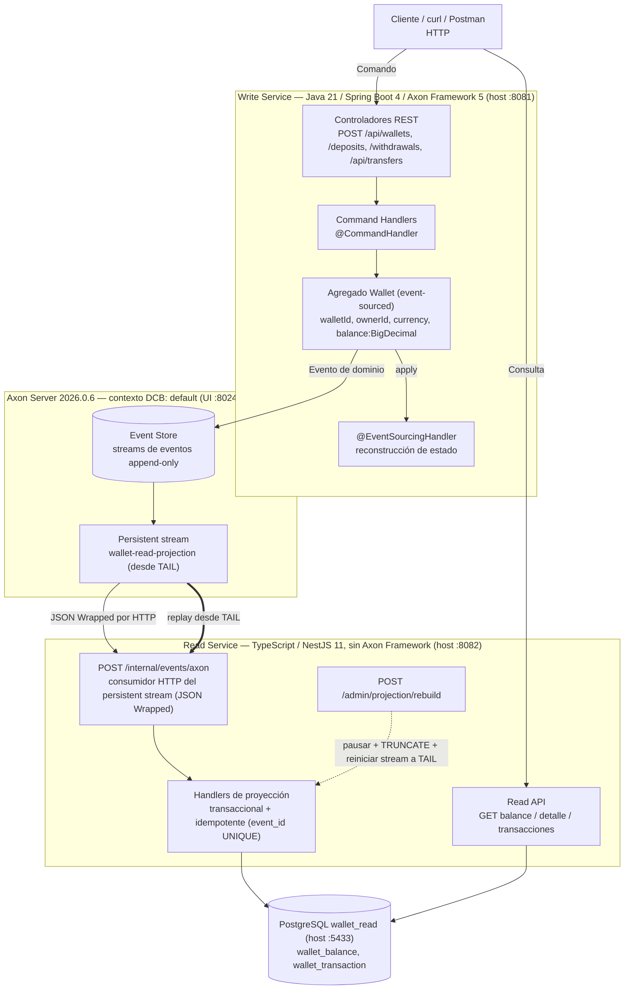

# POC de Monedero — CQRS + Event Sourcing

Una Prueba de Concepto académica que demuestra **CQRS** y **Event Sourcing** de punta a punta para
un único contexto acotado: un **monedero** (wallet) virtual. El objetivo es hacer un flujo
observable y reversible:

```text
Comando HTTP -> reglas de dominio -> Evento de dominio -> Event Store
             -> persistent stream -> proyección -> Read Model -> Consulta HTTP
```

y luego demostrar que el read model puede **descartarse y reconstruirse solo a partir del log de
eventos**, sin ningún comando adicional:

```text
Borrar Read Model + Reproducir Event Store = exactamente el mismo Read Model
```

Es código didáctico, no un monedero de producción. Fija la moneda a `COP`, usa identificadores de
texto libre y deja fuera, de forma deliberada, autenticación, multi-moneda, alta disponibilidad y
observabilidad (ver [Limitaciones](#limitaciones-del-poc)).

---

## Tabla de contenidos

1. [Conceptos: CQRS y Event Sourcing](#conceptos-cqrs-y-event-sourcing)
2. [Por qué Axon Server es el Event Store y por qué PostgreSQL es el Read Model](#por-qué-axon-server-y-por-qué-postgresql)
3. [Por qué el Read Side es TypeScript y el Write Side es Java](#por-qué-read-side-en-typescript-y-write-side-en-java)
4. [Diagrama de arquitectura](#arquitectura)
5. [Estructura del proyecto](#estructura-del-proyecto)
6. [Requisitos previos](#requisitos-previos)
7. [Levantar el stack](#levantar-el-stack)
8. [Registro de la proyección (una sola vez)](#registro-de-la-proyección-una-sola-vez)
9. [Demo con Postman (primera ejecución recomendada)](#demo-con-postman-primera-ejecución-recomendada)
10. [Demo reproducible (crear → depositar → retirar → transferir → consultar)](#demo-reproducible)
11. [Demo de idempotencia](#demo-de-idempotencia)
12. [Ejemplos de errores HTTP](#ejemplos-de-errores-http)
13. [Consistencia eventual](#consistencia-eventual)
14. [Demo de reconstrucción / replay (la demostración principal de event sourcing)](#demo-de-reconstrucción--replay)
15. [Inspeccionar el sistema](#inspeccionar-el-sistema)
16. [Limitaciones del POC](#limitaciones-del-poc)
17. [Qué añadiría un sistema de producción](#qué-añadiría-un-sistema-de-producción)
18. [Contratos de eventos](#contratos-de-eventos)

---

## Conceptos: CQRS y Event Sourcing

**CQRS (Command Query Responsibility Segregation)** separa el modelo que *cambia* el estado del
modelo que lo *lee*. Los comandos expresan la intención de modificar (`CreateWallet`, `DepositMoney`,
`WithdrawMoney`, `TransferMoney`) y son lo único autorizado a producir efectos secundarios. Las
consultas solo leen y nunca mutan nada.

```text
Comandos  -> Write Model   (valida reglas, produce hechos)
Consultas -> Read Model    (optimizado para lectura, nunca valida reglas)
```

En este POC ambos lados son servicios *físicamente* separados con almacenamiento independiente, lo
que hace imposible cruzar la frontera por accidente.

**Event Sourcing** significa que la fuente de verdad no es el estado actual, sino el **log ordenado
de hechos (eventos)** que ocurrieron. El saldo del monedero nunca se guarda como un número mutable
en el write side: se vuelve a derivar reproduciendo sus eventos:

```text
WalletCreated  -> balance = 0.00
MoneyDeposited -> balance += monto
MoneyWithdrawn -> balance -= monto
```

Como el log es la verdad, cualquier proyección de lectura es una caché desechable: bórrala,
reproduce el log y obtienes exactamente el mismo resultado. Esa es la demostración central de este
proyecto.

Ambas ideas se combinan de forma natural: el **write side** añade eventos al event store; el **read
side** se suscribe a esos eventos y materializa tablas cómodas para consulta.

---

## Por qué Axon Server, y por qué PostgreSQL

**Axon Server es el Event Store.** Event Sourcing necesita un log de solo-adición (append-only) con
orden, secuenciación por agregado, concurrencia optimista y un mecanismo de suscripción/streaming
para alimentar las proyecciones. Axon Server proporciona exactamente esto como un event store
específico. Además incluye **persistent streams** que pueden empujar eventos por HTTP a *cualquier*
consumidor (no solo apps de Axon Framework), y permite **reiniciar un stream a `TAIL`** para
reproducir el historial, que es lo que convierte la demo de reconstrucción en un único comando en
vez de una herramienta a medida. En este POC corre como un nodo único, en modo standalone con un
**contexto DCB** llamado `default` (habilitado con `AXONIQ_AXONSERVER_STANDALONE_DCB=true`). El
modelo de eventos basado en tags/criterios de Axon Framework 5 requiere un contexto Dynamic
Consistency Boundary; un contexto clásico (no-DCB) rechaza la escritura de eventos.

**PostgreSQL es el Read Model.** Las consultas quieren tablas relacionales, indexadas y fáciles de
inspeccionar, no un log de eventos. PostgreSQL guarda dos tablas derivadas (`wallet_balance`,
`wallet_transaction`) que son 100% reconstruibles desde el event store. Es intencionalmente una base
de datos separada, con sus propias credenciales y **sin ningún vínculo con almacenamiento del write
side**, de modo que la separación CQRS es real.

---

## Por qué Read Side en TypeScript y Write Side en Java

La división es deliberada y es en sí misma parte de la lección:

- El **Write Side** es **Java 21 / Spring Boot 4 / Axon Framework 5**. El write side es dueño de la
  parte difícil (reglas de dominio, event sourcing, concurrencia de agregados y la frontera de
  consistencia de la transferencia), que es exactamente para lo que Axon Framework está construido.
- El **Read Side** es **TypeScript / NestJS 11** y **no usa Axon Framework en absoluto**. Recibe
  eventos de Axon Server por HTTP plano (los persistent streams nativos de "Integration" de Axon
  Server, en JSON `Wrapped`) y luego escribe en PostgreSQL.

El punto clave que esto demuestra: ambos lados comparten **solo un contrato de eventos JSON
versionado** (`contracts/events/*.v1.schema.json`), **nunca una clase Java compilada**. Un lenguaje
y runtime completamente distintos pueden proyectar los mismos eventos con solo ponerse de acuerdo en
la forma del JSON. Eso es lo que significa "compartir un contrato, no una base de código" en la
práctica.

---

## Arquitectura



Invariantes que el diseño garantiza:

- El Write Service nunca lee PostgreSQL para resolver una regla o reconstruir estado.
- El Read Service nunca lee el Event Store para responder una consulta.
- El Read Service comparte con el Write Service solo un contrato de eventos JSON, nunca un módulo compilado.
- Una consulta no tiene efectos secundarios de escritura; un comando expresa la intención de modificar.

---
## Estructura del proyecto

```text
.
├── compose.yml                     # stack en un solo archivo: 4 servicios + volúmenes + arranque con health-check
├── .env.example                    # plantilla de entorno (copiar a .env); las credenciales viven solo aquí
├── versions.md                     # versiones fijadas y verificadas (sin `latest`)
├── contracts/
│   └── events/                     # JSON Schemas versionados — el contrato de eventos compartido
│       ├── wallet-created.v1.schema.json
│       ├── money-deposited.v1.schema.json
│       ├── money-withdrawn.v1.schema.json
│       └── money-transferred.v1.schema.json
├── infrastructure/
│   ├── postgres/
│   │   └── init.sql                # esquema del Read Model (wallet_balance, wallet_transaction)
│   └── axon/
│       ├── integration-notes.md    # formato verificado de persistent-stream / Wrapped de Axon Server
│       ├── dcb-notes.md            # API verificada de Dynamic Consistency Boundary de Axon 5
│       ├── register-projection.md  # cómo registrar el stream (alternativa por UI + docs del script)
│       ├── register-projection.ps1 # registro del stream una sola vez (Windows PowerShell)
│       └── register-projection.sh  # registro del stream una sola vez (Linux/macOS/WSL/Git Bash)
├── write-service/                  # Java 21 / Spring Boot 4 / Axon Framework 5 (Write Side)
└── read-service/                   # TypeScript / NestJS 11, sin Axon Framework (Read Side)
```

---

## Requisitos previos

- **Docker** y **Docker Compose** (v2, el subcomando `docker compose`).

Eso es todo. Cada toolchain de lenguaje y versión fijada (Java 21, Node 22, Axon Framework 5.3.2,
Spring Boot 4.1.1, Axon Server 2026.0.6, PostgreSQL 16) está incluida en las imágenes Docker; ver
[`versions.md`](./versions.md). No necesitas Java, Node ni un JDK instalados en el host.

---

## Levantar el stack

Copia la plantilla de entorno y luego levanta los cuatro servicios:

```bash
cp .env.example .env
docker compose up --build
```

En Windows PowerShell:

```powershell
Copy-Item .env.example .env
docker compose up --build
```

`.env` proporciona `READ_DB_PASSWORD` y `ADMIN_TOKEN` (y `READ_PROJECTION_DELAY_MS`). Las
credenciales viven solo en `.env`: no están escritas a mano en el archivo compose ni en los
servicios. El arranque está condicionado por health-checks: los servicios write y read esperan a que
Axon Server (y PostgreSQL) reporten estado saludable antes de arrancar.

Mapa de puertos del host:

| Servicio         | URL / puerto                   | Propósito                        |
| ---------------- | ------------------------------ | -------------------------------- |
| Write API        | http://localhost:8081          | Comandos (crear/depositar/…)     |
| Read API         | http://localhost:8082          | Consultas (saldo/transacciones)  |
| Axon Server UI   | http://localhost:8024          | Panel / API del Event Store      |
| Axon Server gRPC | localhost:8124                 | Transporte de comandos/eventos/streams |
| PostgreSQL       | localhost:5433                 | Read Model (`wallet_read`)       |

Health checks: `GET http://localhost:8081/actuator/health` (write) y
`GET http://localhost:8082/health` (read).

---

## Registro de la proyección (una sola vez)

Axon Server entrega los eventos al Read Side de NestJS a través de un **persistent stream** que debe
registrarse **una sola vez**, después de que el stack esté saludable. Esto crea un *endpoint* de
Integration (`wallet-read-service`, HTTP + JSON `Wrapped`, base URL `http://read-service:3000`) y un
*event handler* (`wallet-read-projection`), de un solo segmento, comenzando desde `TAIL` para que la
proyección se construya con el historial completo. No se define ningún filtro de eventos del lado del
servidor: un contexto DCB rechaza un filtro clásico `payloadType = "..."`, y la proyección de NestJS
ya ignora cualquier tipo de evento que no reconozca, por lo que entregar todos los eventos es
correcto.

> **Este paso es preparación de infraestructura, no la demo.** El script de PowerShell/Bash aquí solo
> registra el persistent stream **una vez** (conecta Axon Server para que empuje eventos al Read
> Side). **No** crea monederos ni mueve dinero. La demo funcional de más abajo se ejecuta enteramente
> con **peticiones HTTP planas** (Postman), no con ningún script de automatización.

Ejecuta el script desde la raíz del repositorio una vez que el stack esté arriba:

**Windows (PowerShell):**

```powershell
./infrastructure/axon/register-projection.ps1
```

**Linux / macOS / WSL / Git Bash:**

```bash
bash infrastructure/axon/register-projection.sh
```

O regístralo manualmente a través de la **UI de Axon Server** en http://localhost:8024 — ver
[`infrastructure/axon/register-projection.md`](./infrastructure/axon/register-projection.md) para los
valores exactos de los campos del endpoint/handler.

> **Advertencia `CONFIRM @ :8024`.** Las rutas REST de administración y los cuerpos JSON exactos para
> crear un contexto, un endpoint y un event handler los publica la propia consola de API del Axon
> Server *en ejecución* (Swagger/OpenAPI, accesible desde el panel en el puerto **8024**), no están
> escritos textualmente en la documentación en prosa. Los scripts usan las formas mejor documentadas
> y marcan cada línea de ese tipo con `# CONFIRM @ :8024`; si una llamada devuelve un estado
> inesperado, el script falla de forma ruidosa y te apunta a la consola de API. Si las rutas difieren
> en tu build, confírmalas en `:8024` y actualiza las líneas marcadas, o recurre a los pasos por la UI.

---
## Demo con Postman (primera ejecución recomendada)

Ejecuta la demo funcional como está pensada para mostrarse: como **peticiones HTTP individuales que
lanzas una a una** desde Postman (o cualquier cliente REST), de modo que cada comando y cada consulta
sean visibles. El script de PowerShell de la sección anterior es **solo** para el registro del stream
una única vez; no es la demo.

**Requisitos previos**

1. El stack está arriba (`docker compose up --build`) y los cuatro contenedores están saludables.
2. El persistent stream está registrado **una sola vez** (ver *Registro de la proyección* arriba).
   Este es el único paso de preparación que no es HTTP; todo lo de abajo es HTTP.

**Base URLs**

| Propósito | Base URL                |
| --------- | ----------------------- |
| Write API | `http://localhost:8081` |
| Read API  | `http://localhost:8082` |

**Configurar las peticiones en Postman**

Crea una nueva Colección (por ejemplo *Wallet CQRS POC*) y agrega las peticiones de abajo en orden.
Para cada `POST` define el header `Content-Type: application/json` y pega el JSON en
**Body -> raw -> JSON**. Las peticiones `GET` no necesitan cuerpo.

> Consejo: agrega variables de colección de Postman `writeUrl = http://localhost:8081` y
> `readUrl = http://localhost:8082` y usa `{{writeUrl}}` / `{{readUrl}}` en cada petición para poder
> reapuntar toda la colección de una sola vez.

| # | Método y URL | Cuerpo (raw JSON) | Esperado |
| - | ------------ | ----------------- | -------- |
| 1 | `POST {{writeUrl}}/api/wallets` | `{"walletId":"wallet-001","ownerId":"owner-001","currency":"COP"}` | `201 Created` |
| 2 | `POST {{writeUrl}}/api/wallets` | `{"walletId":"wallet-002","ownerId":"owner-002","currency":"COP"}` | `201 Created` |
| 3 | `POST {{writeUrl}}/api/wallets/wallet-001/deposits` | `{"amount":100000,"currency":"COP"}` | `200 OK` |
| 4 | `POST {{writeUrl}}/api/wallets/wallet-002/deposits` | `{"amount":20000,"currency":"COP"}` | `200 OK` |
| 5 | `POST {{writeUrl}}/api/wallets/wallet-001/withdrawals` | `{"amount":25000,"currency":"COP"}` | `200 OK` |
| 6 | `POST {{writeUrl}}/api/transfers` | `{"transferId":"transfer-001","sourceWalletId":"wallet-001","targetWalletId":"wallet-002","amount":50000,"currency":"COP"}` | `200 OK` |
| 7 | `GET {{readUrl}}/api/wallets/wallet-001/balance` | (ninguno) | `balance = 25000.00` |
| 8 | `GET {{readUrl}}/api/wallets/wallet-002/balance` | (ninguno) | `balance = 70000.00` |
| 9 | `GET {{readUrl}}/api/wallets/wallet-001/transactions` | (ninguno) | `DEPOSIT`, `WITHDRAWAL`, `TRANSFER_OUT` |
| 10 | `GET {{readUrl}}/api/wallets/wallet-002/transactions` | (ninguno) | `DEPOSIT`, `TRANSFER_IN` |

**Qué observar (este es el punto de CQRS + Event Sourcing)**

- Las peticiones **1-6** llegan al **Write Side** (puerto 8081). Solo añaden eventos a Axon Server;
  nunca tocan PostgreSQL.
- Las peticiones **7-10** llegan al **Read Side** (puerto 8082), que sirve desde PostgreSQL — un
  modelo construido **únicamente** reproduciendo los eventos que Axon Server empujó por el persistent
  stream.
- Los saldos en los pasos 7-8 nunca fueron escritos por ningún comando; se **derivan** del log de
  eventos. Esa separación (write = comandos/eventos, read = consultas proyectadas) es exactamente lo
  que aporta CQRS + Event Sourcing.
- El read model es **eventualmente consistente**: después del paso 6, dale un momento a la proyección
  antes de los pasos 7-10 (localmente suele ser sub-segundo; `READ_PROJECTION_DELAY_MS` en `.env`
  puede añadir un retardo artificial para hacer visible el desfase).

**Opcional: prueba también las peticiones de idempotencia y de error**

- Reenvía la petición **6** sin cambios -> **409 Conflict** (`transferId` duplicado; no se añade
  ningún evento, los saldos no cambian). Ver *Demo de idempotencia* abajo.
- Ver *Ejemplos de errores HTTP* abajo para los casos 404 / 409 / 422 / 400 que puedes agregar como
  peticiones adicionales.

> ¿Prefieres la terminal? La misma secuencia como comandos `curl` (y `Invoke-RestMethod` de
> PowerShell) está en *Demo reproducible* justo debajo.

---

## Demo reproducible

La secuencia exacta que un estudiante/instructor puede ejecutar. Usa los IDs de demo `wallet-001` /
`wallet-002`. Estado final esperado: **`wallet-001 = 25000`**, **`wallet-002 = 70000`**.

### 1) Crear dos monederos

```bash
curl -X POST http://localhost:8081/api/wallets \
  -H "Content-Type: application/json" \
  -d '{"walletId":"wallet-001","ownerId":"owner-001","currency":"COP"}'

curl -X POST http://localhost:8081/api/wallets \
  -H "Content-Type: application/json" \
  -d '{"walletId":"wallet-002","ownerId":"owner-002","currency":"COP"}'
```

Equivalente en PowerShell:

```powershell
Invoke-RestMethod -Method Post -Uri http://localhost:8081/api/wallets `
  -ContentType 'application/json' `
  -Body '{"walletId":"wallet-001","ownerId":"owner-001","currency":"COP"}'

Invoke-RestMethod -Method Post -Uri http://localhost:8081/api/wallets `
  -ContentType 'application/json' `
  -Body '{"walletId":"wallet-002","ownerId":"owner-002","currency":"COP"}'
```

### 2) Depositar

```bash
curl -X POST http://localhost:8081/api/wallets/wallet-001/deposits \
  -H "Content-Type: application/json" \
  -d '{"amount":100000,"currency":"COP"}'

curl -X POST http://localhost:8081/api/wallets/wallet-002/deposits \
  -H "Content-Type: application/json" \
  -d '{"amount":20000,"currency":"COP"}'
```

### 3) Retirar

```bash
curl -X POST http://localhost:8081/api/wallets/wallet-001/withdrawals \
  -H "Content-Type: application/json" \
  -d '{"amount":25000,"currency":"COP"}'
```

### 4) Transferir wallet-001 → wallet-002

El cuerpo de la transferencia lleva un `transferId`; también puedes (o en su lugar) enviar un header
`Idempotency-Key`, que tiene prioridad como `transferId` efectivo.

```bash
curl -X POST http://localhost:8081/api/transfers \
  -H "Content-Type: application/json" \
  -H "Idempotency-Key: transfer-001" \
  -d '{"transferId":"transfer-001","sourceWalletId":"wallet-001","targetWalletId":"wallet-002","amount":50000,"currency":"COP"}'
```

PowerShell:

```powershell
Invoke-RestMethod -Method Post -Uri http://localhost:8081/api/transfers `
  -ContentType 'application/json' `
  -Headers @{ 'Idempotency-Key' = 'transfer-001' } `
  -Body '{"transferId":"transfer-001","sourceWalletId":"wallet-001","targetWalletId":"wallet-002","amount":50000,"currency":"COP"}'
```

Total acumulado tras estos pasos:

```text
wallet-001 = 100000 - 25000 - 50000 = 25000
wallet-002 =  20000 + 50000          = 70000
```

### 5) Consultar el Read Model

Los saldos vienen de PostgreSQL, no del event store. (La proyección es asíncrona: dale un momento.)

```bash
curl http://localhost:8082/api/wallets/wallet-001/balance
curl http://localhost:8082/api/wallets/wallet-002/balance
```

`GET /api/wallets/{id}/balance` devuelve `{ walletId, currency, balance, updatedAt }`. Los valores de
`balance` esperados son `25000.00` y `70000.00`.

Historial de transacciones (más reciente primero, con paginación):

```bash
curl "http://localhost:8082/api/wallets/wallet-001/transactions?limit=10&offset=0"
```

Detalle completo del monedero:

```bash
curl http://localhost:8082/api/wallets/wallet-001
```

> Nota sobre las transferencias en el read model: un único evento `MoneyTransferred` se proyecta en
> **dos filas de transacción** — un `TRANSFER_OUT` en el monedero origen y un `TRANSFER_IN` en el
> monedero destino (sus valores `eventId` llevan el sufijo `:OUT` / `:IN` para que ambos sigan siendo
> idempotentes). Los saldos de ambos monederos se actualizan dentro de la misma transacción de
> proyección.

---
## Demo de idempotencia

Repite la **misma** transferencia — mismo `transferId` / `Idempotency-Key`:

```bash
curl -i -X POST http://localhost:8081/api/transfers \
  -H "Content-Type: application/json" \
  -H "Idempotency-Key: transfer-001" \
  -d '{"transferId":"transfer-001","sourceWalletId":"wallet-001","targetWalletId":"wallet-002","amount":50000,"currency":"COP"}'
```

Esperado: **HTTP 409 Conflict**. No se añade ningún evento `MoneyTransferred` nuevo, no se mueve
dinero y los saldos permanecen en `25000` / `70000`. La detección de duplicados está en el **write
side**, con clave `transferId` en el modelo event-sourced, no en una consulta a PostgreSQL.

---

## Ejemplos de errores HTTP

El write side mapea las violaciones de dominio a códigos de estado HTTP de forma consistente (un
único `@RestControllerAdvice`):

**404 — monedero desconocido**

```bash
curl -i -X POST http://localhost:8081/api/wallets/does-not-exist/deposits \
  -H "Content-Type: application/json" \
  -d '{"amount":1000,"currency":"COP"}'
```

**409 — fondos insuficientes**

```bash
curl -i -X POST http://localhost:8081/api/wallets/wallet-001/withdrawals \
  -H "Content-Type: application/json" \
  -d '{"amount":999999999,"currency":"COP"}'
```

**422 — moneda no coincide** (violación semántica; la moneda está fija en `COP`)

```bash
curl -i -X POST http://localhost:8081/api/wallets/wallet-001/deposits \
  -H "Content-Type: application/json" \
  -d '{"amount":1000,"currency":"USD"}'
```

**400 — monto ≤ 0** (o payload malformado / campo requerido faltante)

```bash
curl -i -X POST http://localhost:8081/api/wallets/wallet-001/deposits \
  -H "Content-Type: application/json" \
  -d '{"amount":0,"currency":"COP"}'
```

Resumen del mapeo:

| Condición                                                                                   | Estado |
| ------------------------------------------------------------------------------------------- | ------ |
| Payload inválido/malformado, campo requerido faltante/vacío, monto ≤ 0                      | 400    |
| El monedero no existe                                                                       | 404    |
| Monedero duplicado, fondos insuficientes, auto-transferencia, transferencia duplicada, concurrencia | 409    |
| Moneda no coincide                                                                          | 422    |

---

## Consistencia eventual

CQRS con un almacén de lectura separado es **eventualmente consistente**: un comando se confirma en
el event store *antes* de que la proyección actualice PostgreSQL. Durante una breve ventana el write
side (event store) ya está actualizado mientras el read model todavía muestra el valor anterior; una
vez que el evento se entrega y se proyecta, el read model se pone al día.

```text
Comando -> Event Store              (se confirma primero)
Evento  -> Proyección -> PostgreSQL (un momento después)
```

Para hacer visible esa ventana, el diseño permite un `READ_PROJECTION_DELAY_MS` configurable que
añade un retardo artificial antes de aplicar una proyección. **Esta es una característica
opcional/diferida y por defecto es `0`** (sin retardo artificial). Donde está implementada, fijarla
por ejemplo a `3000` en `.env` y reiniciar el read service te permitiría observar, justo después de un
depósito, que el event store está actualizado pero `GET .../balance` aún devuelve el valor anterior
durante unos segundos, hasta ponerse al día.

Importante: el read model **nunca** se usa para validar retiros o transferencias; esas reglas se
resuelven solo en el write side contra el estado event-sourced.

---

## Demo de reconstrucción / replay

Esta es la demostración central de Event Sourcing: **borrar el read model y reconstruirlo solo a
partir del log de eventos, sin ningún comando nuevo**. Tras una reconstrucción, los saldos vuelven a
`wallet-001 = 25000`, `wallet-002 = 70000`.

### Opción A — el endpoint de administración (preferida)

`POST /admin/projection/rebuild` pausa la aplicación de la proyección, hace `TRUNCATE` de
`wallet_balance` y `wallet_transaction`, reinicia el persistent stream a `TAIL` y reconsume todos los
eventos históricos solo desde Axon Server (nunca desde PostgreSQL ni un segundo log). Protégelo con el
header `X-Admin-Token` igual a tu `ADMIN_TOKEN` de `.env` (si `ADMIN_TOKEN` está vacío el endpoint
queda sin protección).

```bash
curl -X POST http://localhost:8082/admin/projection/rebuild \
  -H "X-Admin-Token: change-me"
```

### Opción B — alternativa manual documentada

Vacía las tablas de proyección directamente y luego reinicia/re-registra el stream a `TAIL` para que
Axon Server reenvíe el historial completo:

```bash
docker compose exec postgres-read \
  psql -U wallet_read -d wallet_read \
  -c "TRUNCATE wallet_transaction; TRUNCATE wallet_balance;"
```

Luego reinicia la posición del stream `wallet-read-projection` de vuelta a `TAIL` (por la UI de Axon
Server en :8024, o re-ejecutando el script de registro). Axon Server reenvía los eventos históricos
con un indicador de replay.

### Verificar

Vuelve a consultar — **sin emitir ningún comando nuevo** — y los saldos se reconstruyen exactamente:

```bash
curl http://localhost:8082/api/wallets/wallet-001/balance   # balance = 25000.00
curl http://localhost:8082/api/wallets/wallet-002/balance   # balance = 70000.00
```

Como las proyecciones son idempotentes (protegidas por `wallet_transaction.event_id UNIQUE`) y
deterministas, reproducir el mismo historial reproduce el mismo estado.

---

## Inspeccionar el sistema

**UI de Axon Server** — el event store, los contextos y los persistent streams:

- Abre http://localhost:8024. Navega los eventos del contexto `default` y confirma que el stream
  `wallet-read-projection` existe y está saludable.

**Tablas de lectura de PostgreSQL** — conéctate al read model (puerto del host 5433):

```bash
docker compose exec postgres-read psql -U wallet_read -d wallet_read
```

```sql
SELECT * FROM wallet_balance;
SELECT * FROM wallet_transaction ORDER BY occurred_at DESC;
```

Directamente desde el host: `psql -h localhost -p 5433 -U wallet_read -d wallet_read` (la contraseña
está en `READ_DB_PASSWORD`).

---

## Limitaciones del POC

Este es un POC didáctico. Intencionalmente **no** implementa:

- Autenticación / autorización reales (el endpoint de reconstrucción usa un único `ADMIN_TOKEN` compartido).
- Múltiples monedas ni conversión de divisas (la moneda está fija en `COP`).
- KYC, conciliación bancaria, pagos externos ni notificaciones.
- Un frontend web / UI propia (todo es demostrable por HTTP).
- Kafka, Redis, Elasticsearch/OpenSearch, Kubernetes.
- Alta disponibilidad, clustering ni multi-región de Axon Server.
- Observabilidad avanzada (métricas, trazas, dashboards).
- Una tabla dedicada `wallet_transfer` (la transferencia se proyecta actualmente como filas de
  transacción emparejadas `TRANSFER_OUT` / `TRANSFER_IN`, lo cual es suficiente para el POC).
- Una suite de pruebas automatizadas (la correctitud se valida manualmente con la demo de este README).

El objetivo es enseñar CQRS + Event Sourcing, no entregar un monedero financiero listo para producción.

---

## Qué añadiría un sistema de producción

- Autenticación/autorización reales (OAuth2/OIDC, aislamiento por inquilino, tokens con alcance) en
  lugar de un token de administración compartido.
- Soporte multi-moneda con reglas explícitas de conversión y redondeo.
- Axon Server en alta disponibilidad (en clúster, multi-nodo), backups y estrategia multi-región.
- Observabilidad: logs estructurados, métricas, trazas distribuidas, dashboards y alertas sobre
  desfase de proyección / eventos en dead-letter.
- Una estrategia de dead-letter / eventos venenosos y herramientas de replay con visibilidad del progreso.
- Estrategia de esquema/versionado para la evolución de eventos (upcasters, múltiples versiones de contrato).
- Despliegue endurecido (Kubernetes, gestión de secretos, políticas de red, TLS en todas partes).
- Rate limiting, endurecimiento de entradas y registro de auditoría en el borde de la API.

---

## Contratos de eventos

Los eventos de dominio se definen como **JSON Schemas versionados** en
[`contracts/events/`](./contracts/events/) y se comparten como un **contrato, no como clases
compiladas**:

```text
contracts/events/wallet-created.v1.schema.json
contracts/events/money-deposited.v1.schema.json
contracts/events/money-withdrawn.v1.schema.json
contracts/events/money-transferred.v1.schema.json
```

Cada payload lleva `eventVersion`; `MoneyDeposited` / `MoneyWithdrawn` / `MoneyTransferred` también
llevan `eventId` y `occurredAt`. Los nombres de eventos están en pasado y son independientes de los
nombres internos de las clases Java. El write side en Java y el read side en TypeScript
validan/deserializan contra estos esquemas **de forma independiente**; no se comparte ningún módulo
Java compilado con el read side. Esa frontera de contrato compartido es lo que permite que un
productor en Java y un consumidor en TypeScript hablen los mismos eventos.